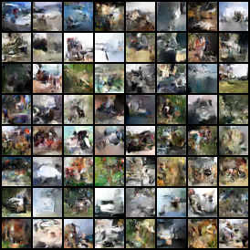
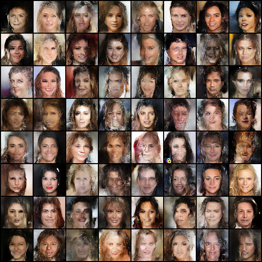

O(1) memory Glow
====

A PyTorch implementation of [Glow](https://arxiv.org/abs/1807.03039) and [RevNet](https://arxiv.org/abs/1707.04585)'s method which enables backpropagation without storing activations.

## Description
RevNet's backprop-method allows you to train wider and deeper models and use larger batch size per PU(Processing Unit) at the expense of additional computation.  
It is implemented using torch.autograd.Function in flows/rev.py.

## Requirements
* pytorch 0.4.1
* torchvision 0.2.1

## Usage
To train on default(CIFAR10) dataset:  
```
$ python train.py
```
With memory-saving backpropagation:
```
$ python train.py --save_memory
```

## Result
Samples generated by the trained model.  
[CIFAR10]  
  
[Celeba-HQ(64x64)]  
  

## Notes
Work in progress.
Some details are not necessarily correct.
